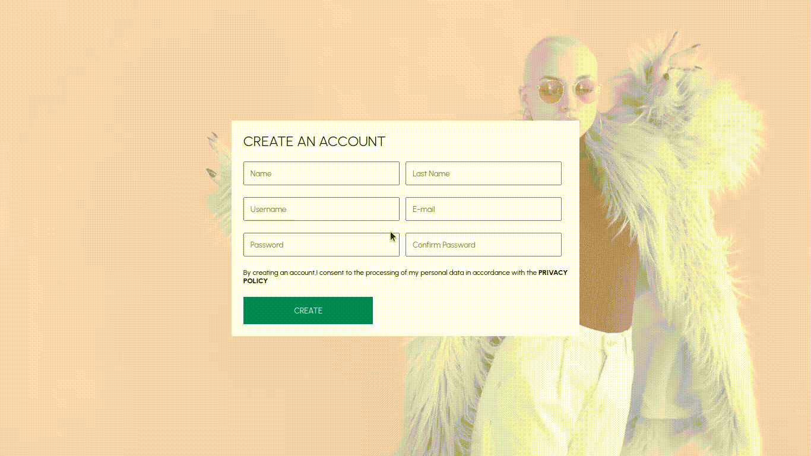
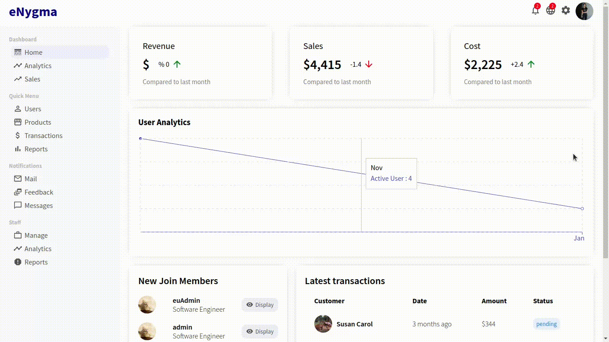
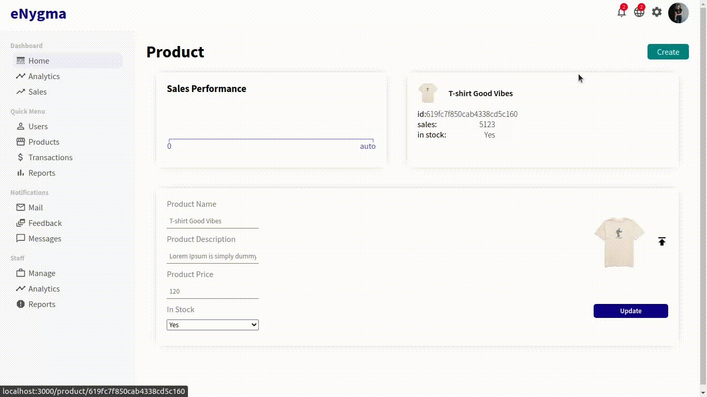

<h1 align="center">
   
</h1>
  
<div align="center">
  <h1>Ecommerce Application with Register,Login, Add To Cart and Payment Method ( Stripe ) funcionality. </h1>
</div>

<p align="center" >
  <a href="#about-the-project-and-how-some-features-works"> About </a> &nbsp;&nbsp;&nbsp;| &nbsp;&nbsp;&nbsp;
  <a href="#see-app-features">Gifs</a> &nbsp;&nbsp;&nbsp;|&nbsp;&nbsp;&nbsp;
  <a href="#getting-started">Getting started</a> &nbsp;&nbsp;&nbsp;|&nbsp;&nbsp;&nbsp;
  <a href="#technologies">Techs</a> &nbsp;&nbsp;&nbsp;|&nbsp;&nbsp;&nbsp;
  <a href="#license">License</a>
</p>

<p align="center">
  <a href="https://github.com/eulazzo" target="_blank">
     
  </a>
    
  
  
</p>

 


 

## About the project and how some features works

### eNygma - ecommerce
## I did a video showing the project, u can check out <a href="https://www.youtube.com/watch?v=h-2jtDs32qc&t=5s">Here</a>

<p>Ecommerce Application with Register,Login, Add To Cart and Payment Method(Stripe) funcionality. <br>
On the painel dasboard you can see some metrics, like last five users that make register, delete, edit and create new products<br>
<p>Developed with <code>ReactJS</code>, <code>NodeJs</code>,<code>Axios</code>,</br><code>Express</code>, <code>JWT</code>,<code>Mongoose</code>  and <code>Redux</code> </p> 

### Features
- [X] Register
- [X] Login
- [X] Add To Cart
- [X] Admin Dashboard
- [X] Payment Method(Stripe) funcionality
- [X] On the painel dasboard you can see some metrics, like the last five users that make register, delete, edit and create new products
- [X] Responsive


# E-COMMERCE ENYGMA :shopping_cart: :shopping_cart: :shopping_cart:

## DOCUMENTATION

* Clone this repo with  <code>git@github.com:eulazzo/ecommerce.git</code> ;
* Move to `api`,`admin`, `client` and run `npm install` to add dependencies;
* Inside api folder create a `.env` file and fill in the follow keys  :
  ```
   MONGO_URL = 
   PASS_SEC = 
   JWT_SEC = 
   STRIPE_KEY =  
  ```
* Inside client folder create a `.env` file and fill in the follow key:
  ```
   REACT_APP_STRIPE=
  ```
* run `npm run start` to start the server.

 ## Endpoints

 ### Products

* ### addProducts
  * Método: POST
  * Path: `/products`
  * First register a user and change `isAdmin` to `true`
  * Use postman or insommia and make login, the output take it the `accessToken`
  * Click on `Headers` and add key `token` and for the value `Bearer PUT HERE YOUR acessToken`
  * Input: (Will return a error in case you are not authenticated)
    ```
      {
         "title": "T-shirt blackPower",
         "desc": "Loren ipsum is dummy test of the winter",
         "img": "https://i.ibb.co/YZC6n90/coat1.png",
         "categories": ["man", "coat"],
         "price":  44,
         "inStock": "true",
         "color": ["blue"],
         "size": ["S", "M", "L"]
        }
    ```
  * Ouput:
    ```
    {
       "title": "T-shirt blackPower",
       "desc": "Loren ipsum is dummy test of the winter",
       "img": "https://i.ibb.co/YZC6n90/coat1.png",
       "categories": [
           "man",
           "coat"
       ],
       "size": [
           "S",
           "M",
           "L"
       ],
       "color": [
           "blue"
       ],
       "price": 44,
       "inStock": true,
       "_id": "62544bd64583b32d4ad97e54",
       "createdAt": "2022-04-11T15:40:06.821Z",
       "updatedAt": "2022-04-11T15:40:06.821Z",
       "__v": 0
      }
    ```
    


* ### GetProduct
  * Método: GET
  * Path: `/products/find/:id`
  * Ouput: 
    ```
    {
       "_id": "619fc82750cab4338cd5c162",
       "title": "T-shirt happyness XL",
       "desc": "Lorem Ipsum is simply dummy text of the printing and typesetting industry. Lorem Ipsum has been the industry's standard dummy text ever since the 1500s, when an unknown printer took a galley of type and scrambled it to make a type specimen book",
       "img": "https://www.prada.com/content/dam/pradanux_products/U/UCS/UCS319/1YOTF010O/UCS319_1YOT_F010O_S_182_SLF.png",
       "categories": [
           "Man"
       ],
       "price": 288,
       "createdAt": "2021-11-24T18:34:04.647Z",
       "updatedAt": "2021-12-02T02:27:51.775Z",
       "__v": 0,
       "inStock": true,
       "color": [
           "Yellow",
           "Black",
           "White"
       ],
       "size": [
           "S",
           "M",
           "L"
        ]
      }
    ```
 
* ### updateProduct
  * Método: PUT
  * Path: `/products/:id`
  * Input: 
    ```
     {
       "price":4000,
      "title":"Herman Why not"
     } 
    ```
   * Output:
     ```
      {
       "_id": "619fc82750cab4338cd5c162",
       "title": "Herman Why not",
       "desc": "Lorem Ipsum is simply dummy text of the printing and typesetting industry. Lorem Ipsum has been the industry's standard dummy text ever since the 1500s, when an unknown printer took a galley of type and scrambled it to make a type specimen book",
       "img": "https://www.prada.com/content/dam/pradanux_products/U/UCS/UCS319/1YOTF010O/UCS319_1YOT_F010O_S_182_SLF.png",
       "categories": [
           "Man"
       ],
       "price": 4000,
       "createdAt": "2021-11-24T18:34:04.647Z",
       "updatedAt": "2022-04-11T15:57:09.362Z",
       "__v": 0,
       "inStock": true,
       "color": [
           "Yellow",
           "Black",
           "White"
       ],
       "size": [
           "S",
           "M",
           "L"
       ]
      }
     ```
 
* ### getAllProducts
  * Método: GET
  * Path: `/products
  * Ouput: 
    ```
      [
       {
           "_id": "619fc7f850cab4338cd5c160",
           "title": "T-shirt Good Vibes",
           "desc": "Lorem Ipsum is simply dummy text of the printing and typesetting industry. Lorem Ipsum has been the industry's standard dummy text ever since the 1500s, when an unknown printer took a galley of type and scrambled it to make a type specimen book",
           "img": " https://d3o2e4jr3mxnm3.cloudfront.net/Mens-Jake-Guitar-Vintage-Crusher-Tee_68382_1_lg.png",
           "categories": [
               "Tshirt"
           ],
           "price": 120,
           "createdAt": "2021-11-24T18:34:04.647Z",
           "updatedAt": "2021-12-02T02:17:45.667Z",
           "__v": 0,
           "inStock": true,
           "color": [
               "Black",
               "Blue",
               "White"
           ],
           "size": [
               "S",
               "M",
               "L"
           ]
       },
       {
           "_id": "619fc81e50cab4338cd5c161",
           "title": "Luxurie Black TPower ",
           "desc": "Lorem Ipsum is simply dummy text of the printing and typesetting industry. Lorem Ipsum has been the industry's standard dummy text ever since the 1500s, when an unknown printer took a galley of type and scrambled it to make a type specimen book",
           "img": "https://cdn.shopify.com/s/files/1/0101/4832/products/Angela_Natural_Tee.png?v=1606780388",
           "categories": [
               "Man",
               "Tshirt"
           ],
           "price": 999,
           "createdAt": "2021-11-24T18:34:04.647Z",
           "updatedAt": "2021-11-24T18:34:04.647Z",
           "__v": 0,
           "inStock": true,
           "color": [
               "Black",
               "Red",
               "Pink",
               "Blue",
               ""
           ],
           "size": [
               "S",
               "M",
               "L"
           ]
       }  
      ]
    ```
 
### Orders

* ### addOrder
  * Método: POST
  * Path: `/orders/`
  * Input: 
    ```
     {
       "userId":"619d1da08037c80957db697c",
       "amount":200,
       "status":"finished",
       "products":[{
           "productId":"619e859c210e6a75eae2bed5",
           "quantity":3
      }],
      "address":{
        "street":"Rua ztoX",
        "from":"USA"
       }
      }
    ```
  * Output:
    ```
      {
          "userId": "619d1da08037c80957db697c",
          "products": [
              {
                  "productId": "619e859c210e6a75eae2bed5",
                  "quantity": 3,
                  "_id": "62545a8e4cd025591a0673f2"
              }
          ],
          "amount": 200,
          "address": {
              "street": "Rua ztoX"",
              "from": "USA"
          },
          "status": "finished",
          "_id": "62545a8e4cd025591a0673f1",
          "createdAt": "2022-04-11T16:42:54.307Z",
          "updatedAt": "2022-04-11T16:42:54.307Z",
          "__v": 0
       }
     ```
 * ### Income
   * Método: GET
   * Path: `/orders/income?token={token}`
   * Output:
     ```
       [
         {
           "_id": 4,
           "total": 200
         }
       ]
     ```
    
 ### User
  * ### Register
    * Método: POST
    * Path: `/register`
    * Input:
      ```
        {
          "username":"eulazzo",
          "email":"lazaro@ctemplar.com",
          "password":"123456"
        }
       ```
    * Ouput:
      ```
       {
          "username": "eulazzo",
          "email": "lazaro@ctemplar.com",
          "password": "U2FsdGVkX18d4Q4Xux+1bVA7NiBaYzcP8xJXVD57WWM=",
          "isAdmin": false,
          "_id": "62545ca44cd025591a0673f9",
          "createdAt": "2022-04-11T16:51:48.785Z",
          "updatedAt": "2022-04-11T16:51:48.785Z",
          "__v": 0
        }
      ```

  * ### Login
    * Método: POST
    * Path: `/login`
    * Input:
      ```
        {
          "username":"eulazzo",
          "password":"123456"
        }
      ```
     * Ouput:
       ```
         {
             "_id": "61f464c27eb80de0e8c2b008",
             "username": "isAdmin",
             "email": "isAdmin@ctemplar.com",
             "isAdmin": true,
             "createdAt": "2022-01-28T21:48:50.314Z",
             "updatedAt": "2022-01-28T21:48:50.314Z",
             "__v": 0,
                "accessToken": "eyJhbGciOiJIUzI1NiIsInR5cCI6IkpBkZTBlOGMyYjAwOCIsImlzQWRtaW4iOnRydWUsImlhdCI6MTY0OTcxNjQ3OCwiZXhwIjo"
         }
       ```

<p>
Ecommerce developed with NodeJs, MongoDB, ReactJS, Styled Component, Redux, Stripe, JWT and Firebase to upload images. So far it has features such as login and registration, add to cart, make payment using Stripe, through the admin panel it is possible to edit and add new products, see the list of products and the number of users who have recently created an account.  
   To make the application more secure, JWT (JSON WEB TOKEN) was used to verify users, providing them a JSON WEB TOKEN after the login process.</br> 
   Thus, when they try to make any request, edit or delete any user or product, it is checked whether the request belongs to the user or  if the user is authorized to perform that action. Since when an application is created, one of the most important things to do is handle authentication and authorization.</br></br> For example, an application where users can create a post and after that they can edit or delete it. The crucial part here is authorization because they (users) should be able to delete only their respective posts, if they try to delete posts from other users they should get an error like “You can't delete this post” or something like that.  
   On the backend, if the login is ok, the JSON WEB TOKEN is created. In the creation process, jwt.sign() received the user ID and the “isAdmin” property as parameters, because when we try to delete a user, the ID inside the JSON WEB TOKEN is checked if it is the same as the one that comes from the database. data, if so, means that this user is a customer and therefore can delete and edit the profile. The isAdmin property, if isAdmin===true, can delete any user or do any CRUD for any other collection in the database.
<p/>

 ## See app features:

### Admin Dashboard

 

### Paying some orders with Stripe Payment

 

### Creating a new product

 

 
## Getting started

1. Clone this repo using `git@github.com:eulazzo/ecommerce.git`
2. Move yourself to the appropriate directory: `cd ecommerce`<br />
3. Run `npm install` to install dependencies<br />

### Getting started with the frontend

1. Move yourself to the frontend folder: `cd client` <br>
2. Run `npm start` or `yarn start` to start the web application <br>
a window will open, but for the data show up, we have to start the back-end server

### Getting started with the backend server

1. Move yourself to the backend folder: `cd api`
2. Create a `.env` file and add the MongoDB url connection in MONGO_URL field
3. Now type yarn run dev, the server will start with nodemon<br>
4. if you dont have yarn installed, type <code> npm install --global yarn </code> on terminal to install it or just use npm instead <br>

### Getting started with Admin
1. Move yourself to the admin folder: `cd admin`
2. Type again <code>npm start</code> for the admin dashboard works properly <br>
3. now you are ready to create an account and login

## Technologies

<table>
   
  <thead>
    <th>Back-end</th>
    <th>Front-end</th>
  </thead>
   
  <tbody>
    <tr>
      <td>Node.js</td>
      <td>ReactJS</td>
    </tr>
     <tr>
      <td>JWT</td>
      <td>Redux</td>
    </tr>
    <tr>
      <td>ExpressJs</td>
      <td>Styled Component</td>
    </tr>
    <tr>
      <td>Axios</td>
      <td>Axios</td>
    </tr>
    <tr>
      <td>Nodemon</td>
      <td>React Hooks</td>
    </tr>
    <tr>
      <td>Cors</td>
      <td>Eslint</td>
    </tr>
    <tr>
      <td>Prettier</td>
      <td>Prettier</td>
    </tr>
  </tbody>
  
</table>

## License

This project is licensed under the MIT License - see the [LICENSE](https://opensource.org/licenses/MIT) page for details.
<!-- <h4>Techs:</h4>

  


  -->

 

 
 

